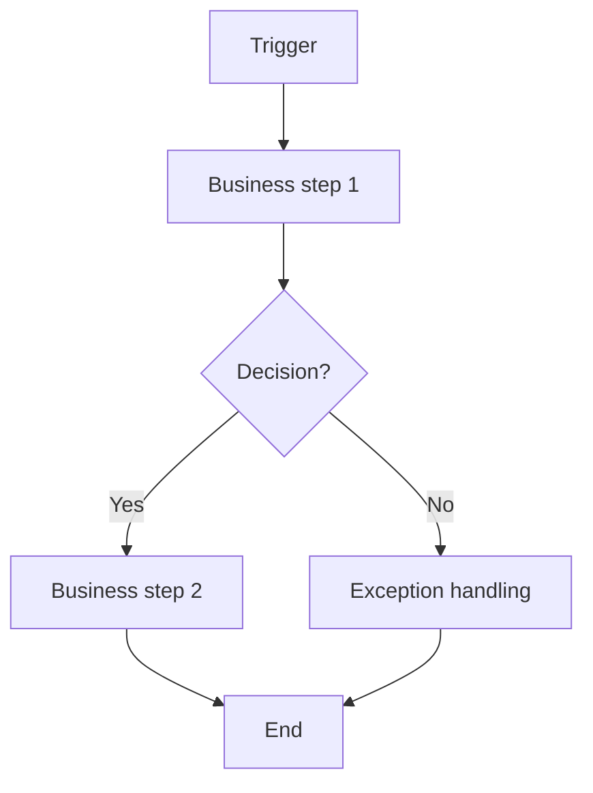

# Process Map Mermaid Template

```mermaid
flowchart TD
    A["Trigger"] --> B["Business step 1"]
    B --> C{"Decision?"}
    C -->|Yes| D["Business step 2"]
    C -->|No| E["Exception handling"]
    D --> F["End"]
    E --> F
```
