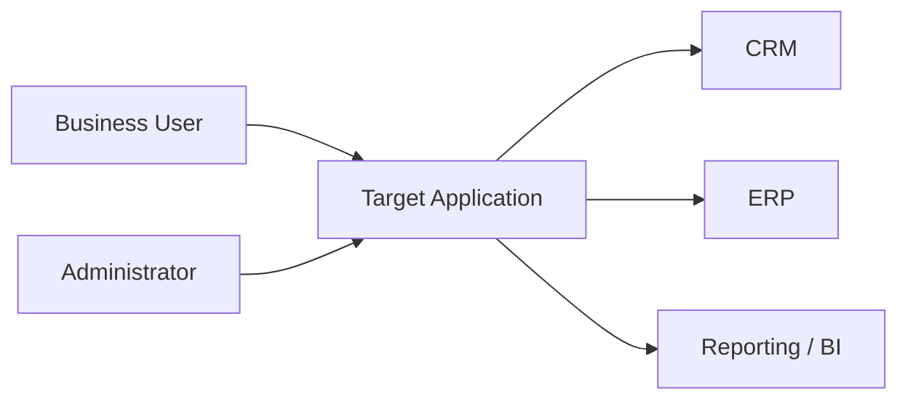

# System Context Mermaid Template

```mermaid
flowchart LR
    User["Business User"] --> App["Target Application"]
    Admin["Administrator"] --> App
    App --> CRM["CRM"]
    App --> ERP["ERP"]
    App --> BI["Reporting / BI"]
```
